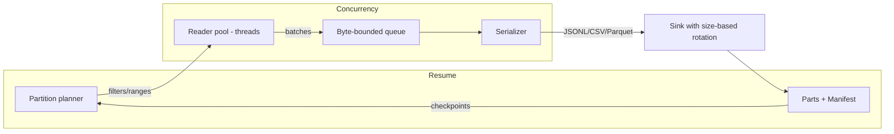

# purplelight

Snapshot MongoDB collections efficiently from Ruby with resumable, partitioned exports to JSONL/CSV/Parquet. Defaults to zstd compression and size-based multi-part outputs. MongoDB 7/8.

### Install

Purplelight is published on RubyGems: [purplelight on RubyGems](https://rubygems.org/gems/purplelight).

Add to your Gemfile:

```ruby
gem 'purplelight', '~> 0.1.10'
```

Or install directly:

```bash
gem install purplelight
```

### Quick start

```ruby
require 'mongo'
require 'purplelight'

client = Mongo::Client.new(ENV.fetch('MONGO_URL'))

Purplelight.snapshot(
  client: client,
  collection: 'users',
  output: '/data/exports',
  format: :jsonl,
  compression: :zstd, # default
  partitions: 8,
  batch_size: 2000,
  query: { active: true },
  sharding: { mode: :by_size, part_bytes: 256 * 1024 * 1024, prefix: 'users' },
  resume: { enabled: true },
  on_progress: ->(s) { puts s.inspect }
)
```

### Filtering with `query`

`query` is passed directly to MongoDB as the filter for the collection read. Use standard MongoDB query operators.

Ruby examples:

```ruby
# Equality
query: { status: 'active' }

# Ranges
query: { created_at: { '$gte' => Time.parse('2025-01-01'), '$lt' => Time.parse('2025-02-01') } }

# $in / $nin
query: { type: { '$in' => %w[user admin] } }

# Nested fields (dot-notation also supported in Mongo)
query: { 'profile.country' => 'US' }

# By ObjectId boundary (works great with _id partitions)
query: { _id: { '$gt' => BSON::ObjectId.from_time(Time.utc(2024, 1, 1)) } }
```

CLI examples (JSON):

```bash
# Equality
--query '{"status":"active"}'

# Date/time range (ISO8601 strings your app can parse downstream)
--query '{"created_at":{"$gte":"2025-01-01T00:00:00Z","$lt":"2025-02-01T00:00:00Z"}}'

# Nested field
--query '{"profile.country":"US"}'

# IN list
--query '{"type":{"$in":["user","admin"]}}'
```

Notes:
- Ensure values are serializable; when using Ruby, you can pass native `Time`, `BSON::ObjectId`, etc.
- Consider adding an appropriate index to match your `query` and pass `hint:` to force indexed scans when needed:

```ruby
Purplelight.snapshot(
  client: client,
  collection: 'events',
  output: '/data/exports',
  format: :jsonl,
  query: { created_at: { '$gte' => Time.parse('2025-01-01') } },
  hint: { created_at: 1 }
)
```

Outputs files like:

```
/data/exports/
  users-part-000000.jsonl.zst
  users-part-000001.jsonl.zst
  users.manifest.json
```

### CSV usage (single-file)

```ruby
Purplelight.snapshot(
  client: client,
  collection: 'users',
  output: '/data/exports',
  format: :csv,
  sharding: { mode: :single_file, prefix: 'users' },
  resume: { enabled: true }
)
```

### Parquet usage (requires Arrow and Parquet gems)

Add optional dependencies:

```ruby
# Gemfile
group :parquet do
  gem 'red-arrow', '~> 15.0'
  gem 'red-parquet', '~> 15.0'
end
```

Then:

```ruby
Purplelight.snapshot(
  client: client,
  collection: 'users',
  output: '/data/exports',
  format: :parquet,
  sharding: { mode: :single_file, prefix: 'users' },
  # Optional: tune row group size
  # parquet_row_group: 50_000,
  resume: { enabled: true }
)
```

### Environment variables (optional)

CLI flags take precedence, but these environment variables can set sensible defaults:

- `PL_ZSTD_LEVEL`: default zstd compression level used by writers.
- `PL_WRITE_CHUNK_BYTES`: JSONL join/write chunk size in bytes.
- `PL_PARQUET_ROW_GROUP`: default Parquet row group size (rows).
- `PL_TELEMETRY`: set to `1` to enable telemetry by default.

### CLI

```bash
bundle exec bin/purplelight \
  --uri "$MONGO_URL" \
  --db mydb --collection users \
  --output /data/exports \
  --format jsonl --partitions 8 --by-size $((256*1024*1024)) --prefix users \
  --queue-mb 512 --rotate-mb 512 --compression zstd --compression-level 6 \
  --read-preference secondary --read-tags nodeType=ANALYTICS,region=EAST \
  --read-concern majority --no-cursor-timeout true
```

#### CLI options (reference)

- `--uri URI` (required): Mongo connection string.
- `--db NAME` (required): Database name.
- `--collection NAME` (required): Collection name.
- `--output PATH` (required): Output directory or file path.
- `--format FORMAT`: `jsonl|csv|parquet` (default `jsonl`).
- `--compression NAME`: `zstd|gzip|none` (default `zstd`).
- `--compression-level N`: Compression level (zstd or gzip; writer-specific defaults if omitted).
- `--partitions N`: Number of reader partitions (defaults to ≥4 and ≤32 based on cores).
- `--batch-size N`: Mongo batch size (default 2000).
- `--queue-mb MB`: In-memory queue size in MB (default 256).
- `--rotate-mb MB`: Target rotate size for JSONL/CSV parts in MB (default 256). For multi-part outputs, pairs well with `--by-size`.
- `--by-size BYTES`: Plan size-based sharding for multi-part outputs.
- `--single-file`: Single output file (CSV/Parquet; JSONL remains multi-part).
- `--prefix NAME`: Output filename prefix (defaults to collection name when output is a directory).
- `--query JSON`: Filter as JSON/Extended JSON (supports `$date`, `$oid`, etc.).
- `--projection JSON`: Projection as JSON, e.g. `{"_id":1,"email":1}`.
- `--read-preference MODE`: `primary|primary_preferred|secondary|secondary_preferred|nearest`.
- `--read-tags key=value[,key=value...]`: Tag sets for node pinning.
- `--read-concern LEVEL`: `majority|local|linearizable|available|snapshot`.
- `--no-cursor-timeout BOOL`: Toggle `noCursorTimeout` (default true).
- `--parquet-row-group N`: Parquet row group size (rows).
- `--write-chunk-mb MB`: JSONL encode/write chunk size before enqueueing.
- `--writer-threads N` (experimental): Number of writer threads (JSONL only).
- `--telemetry on|off`: Force enable/disable telemetry output.
- `--resume-overwrite-incompatible`: Overwrite an existing incompatible manifest to safely resume anew.
- `--dry-run`: Print effective read preference JSON and exit (no snapshot).
- `--version`, `--help`: Utility commands.

Notes:
- Compression backend selection order is: requested format → `zstd-ruby` → `zstds` → `gzip`.
- `--single-file` and `--by-size` update only the sharding mode/params and preserve any provided `--prefix`.

### Architecture



Key points:
- Partitions default to contiguous `_id` ranges with sorted reads and `no_cursor_timeout`.
- Readers stream batches into a bounded, byte-aware queue to provide backpressure.
- Writers serialize to JSONL/CSV/Parquet with default zstd compression and rotate by target size.
- A manifest records parts and per-partition checkpoints for safe resume.

### Tuning for performance

- **Partitions**: start with `2 × cores` (default). Increase gradually if reads are underutilized; too high can add overhead. CLI: `--partitions`.
- **Batch size**: 2k–10k usually works well. Larger batches reduce cursor roundtrips, but can raise latency/memory. CLI: `--batch-size`.
- **Queue size**: increase to 256–512MB to reduce backpressure on readers for fast disks. CLI: `--queue-mb`.
- **Compression**: prefer `zstd`; adjust level to balance speed/ratio. CLI: `--compression zstd --compression-level N`. For max speed, try `--compression gzip --compression-level 1`.
- **Rotation size**: larger (512MB–1GB) reduces finalize overhead for many parts. CLI: `--rotate-mb` (and/or `--by-size`).
- **JSONL chunking**: tune builder write chunk size for throughput. CLI: `--write-chunk-mb`.
- **Parquet row groups**: choose a row group size that fits downstream readers. CLI: `--parquet-row-group`.
- **Read preference**: offload to secondaries or tagged analytics nodes when available. CLI: `--read-preference`, `--read-tags`.
- **Read concern**: pick an appropriate level for consistency/latency trade-offs. CLI: `--read-concern`.
- **Cursor timeout**: for very long scans, leave `noCursorTimeout` enabled. CLI: `--no-cursor-timeout true|false`.
- **Telemetry**: enable to inspect timing breakdowns; disable for minimal output. CLI: `--telemetry on|off`.

Benchmarking (optional):

```bash
# 1M docs benchmark with tunables (JSONL)
BENCH=1 BENCH_PARTITIONS=16 BENCH_BATCH_SIZE=8000 BENCH_QUEUE_MB=512 BENCH_ROTATE_MB=512 BENCH_COMPRESSION=gzip \
  bundle exec rspec spec/benchmark_perf_spec.rb --format doc

# Parquet benchmark (requires Arrow/Parquet)
BENCH=1 BENCH_FORMAT=parquet BENCH_PARQUET_ROW_GROUP=50000 BENCH_PARTITIONS=16 BENCH_BATCH_SIZE=8000 \
  bundle exec rspec spec/benchmark_perf_spec.rb --format doc
```

### Read preference and node pinning

You can direct reads to non-primary members or specific tagged nodes in a replica set (e.g., MongoDB Atlas analytics nodes) via `read_preference`.

Programmatic examples:

```ruby
# Secondary reads
Purplelight.snapshot(
  client: client,
  collection: 'events',
  output: '/data/exports',
  format: :jsonl,
  read_preference: :secondary
)

# Pin to tagged nodes (Atlas analytics nodes)
Purplelight.snapshot(
  client: client,
  collection: 'events',
  output: '/data/exports',
  format: :jsonl,
  read_preference: { mode: :secondary, tag_sets: [{ 'nodeType' => 'ANALYTICS' }] }
)
```

Notes:
- `read_preference` accepts a symbol (mode) or a full hash with `mode` and optional `tag_sets`.
- Use tags that exist on your cluster. Atlas analytics nodes can be targeted with `{ 'nodeType' => 'ANALYTICS' }`.

CLI examples:

```bash
# Secondary reads
bundle exec bin/purplelight \
  --uri "$MONGO_URL" --db mydb --collection events --output /data/exports \
  --format jsonl --read-preference secondary

# Pin to tagged nodes (Atlas analytics nodes)
bundle exec bin/purplelight \
  --uri "$MONGO_URL" --db mydb --collection events --output /data/exports \
  --format jsonl --read-preference secondary \
  --read-tags nodeType=ANALYTICS,region=EAST

# Inspect effective read preference without running
bundle exec bin/purplelight \
  --uri "$MONGO_URL" --db mydb --collection events --output /tmp \
  --read-preference secondary --read-tags nodeType=ANALYTICS --dry-run
```

### Quick Benchmark
```
% BENCH=1 BENCH_PARTITIONS=16 BENCH_BATCH_SIZE=8000 BENCH_QUEUE_MB=512 BENCH_ROTATE_MB=512 BENCH_COMPRESSION=gzip bundle exec rspec spec/benchmark_perf_spec.rb --format doc

Performance benchmark (1M docs, gated by BENCH=1)
Benchmark results:
  Inserted: 1000000 docs in 8.13s
  Exported: 1000000 docs in 4.03s
  Parts:    1, Bytes: 10625336
  Throughput: 248241.7 docs/s, 2.52 MB/s
  Settings: partitions=16, batch_size=8000, queue_mb=512, rotate_mb=512, compression=gzip
  exports 1,000,000 documents and reports throughput

Finished in 14.02 seconds (files took 0.31974 seconds to load)
1 example, 0 failures
```

Additional BENCH variables:

- `BENCH_FORMAT`: `jsonl|parquet` (default `jsonl`).
- `BENCH_PARQUET_ROW_GROUP`: Parquet row group size (rows), e.g. `50000`.
