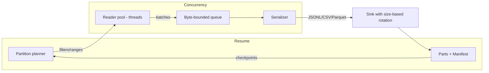

# purplelight

Snapshot MongoDB collections efficiently from Ruby with resumable, partitioned exports to JSONL/CSV/Parquet. Defaults to zstd compression and size-based multi-part outputs. MongoDB 7/8.

### Install

Add to your Gemfile:

```ruby
gem 'purplelight'
```

### Quick start

```ruby
require 'mongo'
require 'purplelight'

client = Mongo::Client.new(ENV.fetch('MONGO_URL'))

Purplelight.snapshot(
  client: client,
  collection: 'users',
  output: '/data/exports',
  format: :jsonl,
  compression: :zstd, # default
  partitions: 8,
  batch_size: 2000,
  query: { active: true },
  sharding: { mode: :by_size, part_bytes: 256 * 1024 * 1024, prefix: 'users' },
  resume: { enabled: true },
  on_progress: ->(s) { puts s.inspect }
)
```

Outputs files like:

```
/data/exports/
  users-part-000000.jsonl.zst
  users-part-000001.jsonl.zst
  users.manifest.json
```

### CSV usage (single-file)

```ruby
Purplelight.snapshot(
  client: client,
  collection: 'users',
  output: '/data/exports',
  format: :csv,
  sharding: { mode: :single_file, prefix: 'users' },
  resume: { enabled: true }
)
```

### Parquet usage (requires Arrow and Parquet gems)

Add optional dependencies:

```ruby
# Gemfile
group :parquet do
  gem 'red-arrow', '~> 15.0'
  gem 'red-parquet', '~> 15.0'
end
```

Then:

```ruby
Purplelight.snapshot(
  client: client,
  collection: 'users',
  output: '/data/exports',
  format: :parquet,
  sharding: { mode: :single_file, prefix: 'users' },
  resume: { enabled: true }
)
```

### CLI

```bash
bundle exec bin/purplelight \
  --uri "$MONGO_URL" \
  --db mydb --collection users \
  --output /data/exports \
  --format jsonl --partitions 8 --by-size $((256*1024*1024)) --prefix users
```

### Architecture



Key points:
- Partitions default to contiguous `_id` ranges with sorted reads and `no_cursor_timeout`.
- Readers stream batches into a bounded, byte-aware queue to provide backpressure.
- Writers serialize to JSONL/CSV/Parquet with default zstd compression and rotate by target size.
- A manifest records parts and per-partition checkpoints for safe resume.

