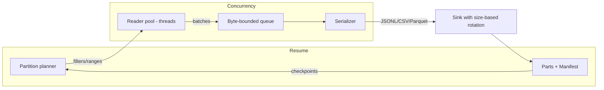

# purplelight

Snapshot MongoDB collections efficiently from Ruby with resumable, partitioned exports to JSONL/CSV/Parquet. Defaults to zstd compression and size-based multi-part outputs. MongoDB 7/8.

### Install

Purplelight is published on RubyGems: [purplelight on RubyGems](https://rubygems.org/gems/purplelight).

Add to your Gemfile:

```ruby
gem 'purplelight', '~> 0.1.7'
```

Or install directly:

```bash
gem install purplelight
```

### Quick start

```ruby
require 'mongo'
require 'purplelight'

client = Mongo::Client.new(ENV.fetch('MONGO_URL'))

Purplelight.snapshot(
  client: client,
  collection: 'users',
  output: '/data/exports',
  format: :jsonl,
  compression: :zstd, # default
  partitions: 8,
  batch_size: 2000,
  query: { active: true },
  sharding: { mode: :by_size, part_bytes: 256 * 1024 * 1024, prefix: 'users' },
  resume: { enabled: true },
  on_progress: ->(s) { puts s.inspect }
)
```

### Filtering with `query`

`query` is passed directly to MongoDB as the filter for the collection read. Use standard MongoDB query operators.

Ruby examples:

```ruby
# Equality
query: { status: 'active' }

# Ranges
query: { created_at: { '$gte' => Time.parse('2025-01-01'), '$lt' => Time.parse('2025-02-01') } }

# $in / $nin
query: { type: { '$in' => %w[user admin] } }

# Nested fields (dot-notation also supported in Mongo)
query: { 'profile.country' => 'US' }

# By ObjectId boundary (works great with _id partitions)
query: { _id: { '$gt' => BSON::ObjectId.from_time(Time.utc(2024, 1, 1)) } }
```

CLI examples (JSON):

```bash
# Equality
--query '{"status":"active"}'

# Date/time range (ISO8601 strings your app can parse downstream)
--query '{"created_at":{"$gte":"2025-01-01T00:00:00Z","$lt":"2025-02-01T00:00:00Z"}}'

# Nested field
--query '{"profile.country":"US"}'

# IN list
--query '{"type":{"$in":["user","admin"]}}'
```

Notes:
- Ensure values are serializable; when using Ruby, you can pass native `Time`, `BSON::ObjectId`, etc.
- Consider adding an appropriate index to match your `query` and pass `hint:` to force indexed scans when needed:

```ruby
Purplelight.snapshot(
  client: client,
  collection: 'events',
  output: '/data/exports',
  format: :jsonl,
  query: { created_at: { '$gte' => Time.parse('2025-01-01') } },
  hint: { created_at: 1 }
)
```

Outputs files like:

```
/data/exports/
  users-part-000000.jsonl.zst
  users-part-000001.jsonl.zst
  users.manifest.json
```

### CSV usage (single-file)

```ruby
Purplelight.snapshot(
  client: client,
  collection: 'users',
  output: '/data/exports',
  format: :csv,
  sharding: { mode: :single_file, prefix: 'users' },
  resume: { enabled: true }
)
```

### Parquet usage (requires Arrow and Parquet gems)

Add optional dependencies:

```ruby
# Gemfile
group :parquet do
  gem 'red-arrow', '~> 15.0'
  gem 'red-parquet', '~> 15.0'
end
```

Then:

```ruby
Purplelight.snapshot(
  client: client,
  collection: 'users',
  output: '/data/exports',
  format: :parquet,
  sharding: { mode: :single_file, prefix: 'users' },
  resume: { enabled: true }
)
```

### CLI

```bash
bundle exec bin/purplelight \
  --uri "$MONGO_URL" \
  --db mydb --collection users \
  --output /data/exports \
  --format jsonl --partitions 8 --by-size $((256*1024*1024)) --prefix users
```

### Architecture



Key points:
- Partitions default to contiguous `_id` ranges with sorted reads and `no_cursor_timeout`.
- Readers stream batches into a bounded, byte-aware queue to provide backpressure.
- Writers serialize to JSONL/CSV/Parquet with default zstd compression and rotate by target size.
- A manifest records parts and per-partition checkpoints for safe resume.

### Tuning for performance

- Partitions: start with `2 × cores` (default). Increase gradually if reads are underutilized; too high can add overhead.
- Batch size: 2k–10k usually works well. Larger batches reduce cursor roundtrips, but can raise latency/memory.
- Queue size: increase to 256–512MB to reduce backpressure on readers for fast disks.
- Compression: use `:zstd` for good ratio; for max speed, try `:gzip` with low level.
- Rotation size: larger (512MB–1GB) reduces finalize overhead for many parts.
- Read preference: offload to secondaries or tagged analytics nodes when available.

Benchmarking (optional):

```bash
# 1M docs benchmark with tunables
BENCH=1 BENCH_PARTITIONS=16 BENCH_BATCH_SIZE=8000 BENCH_QUEUE_MB=512 BENCH_ROTATE_MB=512 BENCH_COMPRESSION=gzip \
  bundle exec rspec spec/benchmark_perf_spec.rb --format doc
```

### Read preference and node pinning

You can direct reads to non-primary members or specific tagged nodes in a replica set (e.g., MongoDB Atlas analytics nodes) via `read_preference`.

Programmatic examples:

```ruby
# Secondary reads
Purplelight.snapshot(
  client: client,
  collection: 'events',
  output: '/data/exports',
  format: :jsonl,
  read_preference: :secondary
)

# Pin to tagged nodes (Atlas analytics nodes)
Purplelight.snapshot(
  client: client,
  collection: 'events',
  output: '/data/exports',
  format: :jsonl,
  read_preference: { mode: :secondary, tag_sets: [{ 'nodeType' => 'ANALYTICS' }] }
)
```

Notes:
- `read_preference` accepts a symbol (mode) or a full hash with `mode` and optional `tag_sets`.
- Use tags that exist on your cluster. Atlas analytics nodes can be targeted with `{ 'nodeType' => 'ANALYTICS' }`.

CLI examples:

```bash
# Secondary reads
bundle exec bin/purplelight \
  --uri "$MONGO_URL" --db mydb --collection events --output /data/exports \
  --format jsonl --read-preference secondary

# Pin to tagged nodes (Atlas analytics nodes)
bundle exec bin/purplelight \
  --uri "$MONGO_URL" --db mydb --collection events --output /data/exports \
  --format jsonl --read-preference secondary \
  --read-tags nodeType=ANALYTICS,region=EAST

# Inspect effective read preference without running
bundle exec bin/purplelight \
  --uri "$MONGO_URL" --db mydb --collection events --output /tmp \
  --read-preference secondary --read-tags nodeType=ANALYTICS --dry-run
```

### Quick Benchmark
```
% bash -lc 'BENCH=1 BENCH_PARTITIONS=16 BENCH_BATCH_SIZE=8000 BENCH_QUEUE_MB=512 BENCH_ROTATE_MB=512 BENCH_COMPRESSION=gzip bundle exec rspec spec/benchmark_perf_spec.rb --format doc | cat'

Performance benchmark (1M docs, gated by BENCH=1)
W, [2025-09-03T16:10:40.437304 #33546]  WARN -- : MONGODB | Error checking 127.0.0.1:27018: Mongo::Error::SocketError: Errno::ECONNREFUSED: Connection refused - connect(2) for 127.0.0.1:27018 (for 127.0.0.1:27018 (no TLS)) (on 127.0.0.1:27018)
Benchmark results:
  Inserted: 1000000 docs in 8.16s
  Exported: 1000000 docs in 8.21s
  Parts:    1, Bytes: 10646279
  Throughput: 121729.17 docs/s, 1.24 MB/s
  Settings: partitions=16, batch_size=8000, queue_mb=512, rotate_mb=512, compression=gzip
```
